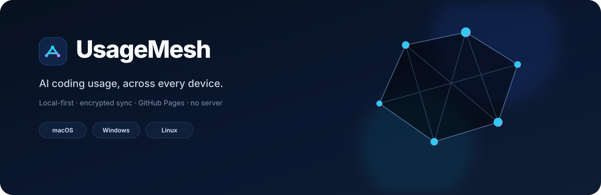

<p align="center">
  
</p>

<p align="center">
  <strong>面向 AI Coding 工具的本地优先、无服务器、跨设备用量分析。</strong><br/>
  每台设备本地采集，使用你自己的 GitHub Fork 同步加密账本，并由你自己的 GitHub Pages 托管 Dashboard。
</p>

<p align="center"><a href="README.md">English</a> · <a href="SECURITY.md">安全模型</a> · <a href="docs/PRICING.md">费用口径</a></p>

## UsageMesh 是什么

UsageMesh 解决的是一个具体问题：当 Codex、Claude Code 等 AI Coding 工具分散运行在多台 Mac、Windows、Linux 设备上时，如何在**不自建服务器**的情况下统一查看 Token、请求、缓存、模型、设备和费用估算。

- **跨设备**：多台机器汇总到同一个工作区。
- **本地优先**：本地扫描，不以上传 Prompt、回复、源代码或完整会话为设计目标。
- **上传前加密**：设备账本使用 AES-256-GCM 加密后才写入 GitHub。
- **零服务器**：GitHub 分支承担同步，GitHub Pages 承担网页展示。
- **Fork 即工作区**：数据进入你自己的 Fork，网页属于你自己的 Pages 地址。
- **概览与分析分工明确**：概览回答“用了多少”，分析页回答“为什么高、由谁贡献、结构是否健康”。

## 快速开始

### 1. Fork 仓库并启用 Pages

Fork `Atingaii/UsageMesh` 到自己的 GitHub 账号并保持 **Public**。纯前端 Dashboard 需要在没有服务器代理的情况下读取密文；实际设备明细在上传前已经加密。

GitHub 对新 Fork 的 Actions 有平台级安全限制，不会自动直接执行上游工作流。因此第一次需要进入你自己 Fork 的 **Actions** 页面启用工作流，然后手动运行一次 **Deploy Dashboard**。如果 Pages 尚未启用，则进入 **Settings → Pages → Source → GitHub Actions**，随后重新运行 **Deploy Dashboard**。

### 2. 准备 GitHub 认证（不需要安装 GitHub CLI）

UsageMesh 需要对**你自己的 Fork**具有写权限，用来更新加密账本分支。推荐使用 Fine-grained Personal Access Token：

1. 打开 GitHub **Settings → Developer settings → Personal access tokens → Fine-grained tokens**，也可以直接访问 [Generate new token](https://github.com/settings/personal-access-tokens/new)。
2. `Resource owner` 选择自己的 GitHub 账号。
3. `Repository access` 选择 **Only select repositories**，只勾选自己的 `UsageMesh` Fork。
4. `Repository permissions` 设置 **Contents → Read and write**。设备同步不需要额外仓库权限。
5. 设置合理的过期时间并生成 Token；复制好 `github_pat_...`，GitHub 通常不会再次完整显示它。

**不要把 PAT 写进安装命令。** 稍后执行 `usagemesh setup` 时，如果没有检测到其他 GitHub 凭据，UsageMesh 会显示隐藏输入框：

```text
GitHub token (hidden; stored locally for scheduled sync):
```

直接粘贴 `github_pat_...` 后按 Enter 即可，终端不回显字符是正常现象。

如果你本来就安装并登录了 GitHub CLI，也可以选择使用：

```bash
gh auth login
gh auth status
```

UsageMesh 会自动尝试读取 `gh auth token`。**GitHub CLI 只是可选方式，不是安装 UsageMesh 的依赖。**

### 3. 安装并初始化 UsageMesh

macOS / Linux：

```bash
curl -fsSL https://raw.githubusercontent.com/Atingaii/UsageMesh/main/install.sh | sh
usagemesh setup
```

Windows PowerShell：

```powershell
irm https://raw.githubusercontent.com/Atingaii/UsageMesh/main/install.ps1 | iex
usagemesh setup
```

`setup` 会根据 GitHub 凭据识别你的账号，发现你自己的 `UsageMesh` Fork，询问 Dashboard 密码，完成第一次全量扫描，并安装系统原生的定时同步任务，默认 **每 30 秒同步一次**。新建或主动修改的 Dashboard 密码要求至少 12 个字符/字节；已有工作区升级后不会重置密码，原密码继续有效。

第一次全量同步还会先把用户 Fork 的 `main` 自动同步到当前 `Atingaii/UsageMesh` 上游版本，再上传设备数据。因此即使用户很早以前就 Fork 过，也不需要再手工点击 GitHub 的 **Sync fork**。

GitHub 凭据的读取顺序是：显式 `--token` → `USAGEMESH_GITHUB_TOKEN` / `GITHUB_TOKEN` / `GH_TOKEN` → 已登录的 `gh auth token` → **终端隐藏输入 PAT**。普通用户无需使用 `--token`，避免把 Token 留在 Shell 历史中。

### 4. 打开自己的 Dashboard

```bash
usagemesh dashboard
```

地址由实际 Fork 自动决定。例如账号为 `alice`、Fork 名仍为 `UsageMesh` 时，地址为 `https://alice.github.io/UsageMesh/`。如果 Fork 改名，使用 `usagemesh setup --repo OWNER/RENAMED_REPO` 初始化后，Dashboard 地址也会根据真实仓库名自动生成。

## 无感自动更新

从 **UsageMesh v2.0.2** 开始，正常同步本身就是升级机制。系统定时任务执行 `usagemesh sync` 时会发现 GitHub 上最新的**稳定版** Release；如果存在新版本，UsageMesh 会自动下载当前系统对应的发布包和 SHA-256 校验文件，完成校验，把用户自己的 Fork 同步到当前上游，然后原地替换 CLI，并自动继续本次同步。

升级过程**不会重新初始化工作区**。仓库地址、工作区密钥、Dashboard 密码、设备 ID 和 GitHub 凭据都保持不变。当前正式版本对已安装定时任务统一采用 **30 秒近实时同步**；如果某台设备明确使用了 `--no-schedule`，升级也不会擅自为它创建定时任务。

正式版本只有在受支持平台完成构建、测试和安装冒烟测试以后，才会从候选 prerelease 提升为 `latest`。失败的候选版本不会被自动更新程序看到。

如果受控环境不希望自动升级，可以设置 `USAGEMESH_AUTO_UPDATE=0`。重新运行最初的安装命令仍然保留为恢复手段；安装器检测到已有配置后会自动完成全量刷新，不再要求用户额外执行第二条升级命令。

## Dashboard 如何保持最新

用户在 Fork 中启用 **Deploy Dashboard** 以后，每次部署都会直接使用当前 `Atingaii/UsageMesh` 上游的最新 Dashboard 源码，而不是盲目使用用户 Fork 里可能已经过期的 `web-ui` 副本。工作流还会**每天自动部署一次**，因此后续的网页修复可以自动进入用户自己的 GitHub Pages，不需要重新 Fork。

部署后的站点会额外生成 `/build-info.json`，里面记录当前工作区仓库、Dashboard 上游仓库以及本次真正使用的上游 commit SHA。以后如果出现“网页明明设置正确但行为像旧版本”的问题，可以直接判断是否为旧部署，而不会误报成密码错误。

## 添加新设备

已有设备：

```bash
usagemesh invite
```

把输出的完整 `usagemesh join '...'` 命令复制到新设备执行。Pair Code 包含工作区加密密钥和仓库信息，但**不包含 GitHub Token**，仍应把它当作敏感信息。

新设备同样需要自己的 GitHub 写入凭据；可以使用 Fine-grained PAT，也可以使用已经登录的 GitHub CLI。`join` 成功后会完成首次全量同步，因此通常无需立刻再执行一次 `sync --full`。

验证状态：

```bash
usagemesh status
```

## GitHub Pages 打不开怎么办

先确认 Fork 的 **Actions → Deploy Dashboard** 最后一次运行是绿色 `success`，然后确认 **Settings → Pages** 的 Source 为 **GitHub Actions**。

使用 CLI 输出的准确地址：

```bash
usagemesh dashboard
```

如果仍然打不开，可以检查：

```bash
curl -I "$(usagemesh dashboard)"
nslookup github.io
```

- 返回 `200`：Pages 已在线，优先尝试无痕窗口或强制刷新。
- 返回 `404`：确认仓库名称大小写和 Pages 部署；新启用 Pages 时也可能需要短暂传播时间。
- `Could not resolve host` / DNS 失败：这是当前网络到 `github.io` 的解析或可达性问题，换网络或 DNS 后再试，与 UsageMesh 数据同步本身无关。

Dashboard 的静态资源使用相对路径，因此 Fork 改名后也不会依赖固定的 `/UsageMesh/` 资源前缀。

## 为什么分“概览”和“分析”

**概览**只保留适合第一眼判断状态的信息：总体用量、费用估算、趋势、设备与近期活动。

**分析工作台**不再重复概览数字，而是提供近实时“请求明细”：展示每条可解析请求/用量事件的具体时间、设备、客户端、模型、路由、速率/Tier、输入/缓存/输出/Reasoning Tokens、耗时（来源有记录时）、请求级费用估算，以及**来源客户端明确记录的思考强度**。UsageMesh 会识别常见的 `reasoningEffort`、`reasoning.effort`、`thinkingLevel`、thinking/reasoning budget 等字段，并覆盖多个文本日志型客户端。若客户端本身没有记录该字段，UsageMesh 会继续显示 `—`，不会根据模型名或 Token 数猜测。

## 安全设计

- **Ledger 加密**：AES-256-GCM，上传前加密。
- **随机工作区密钥**：实际设备账本由随机 256-bit workspace key 加密，Dashboard 密码只负责包装这把密钥。
- **原密码兼容**：已有 v1 工作区即使使用早期 310,000 次 PBKDF2 参数，升级后仍可直接使用原来的 Dashboard 密码登录，不需要重置。
- **新密码强化**：新建或主动修改密码使用 PBKDF2-HMAC-SHA256 **600,000 次** + 随机 salt + AES-256-GCM 包装。
- **浏览器安全会话**：Dashboard 密码本身从不持久化；workspace key 只以 AES-GCM 密文形式保存在当前标签页的 `sessionStorage`，对应的随机包装密钥以不可导出的 WebCrypto `CryptoKey` 存入 IndexedDB。普通刷新可自动恢复；闲置 30 分钟、12 小时绝对期限、手动锁定或关闭标签页后需要重新输入原密码。
- **CSP**：静态 Dashboard 使用严格 Content Security Policy，脚本仅允许本站资源，网络连接限制到本站与 `raw.githubusercontent.com`，并禁用对象与表单提交；不加载第三方分析脚本。
- **Pair Code**：不含 GitHub PAT，但含 workspace key，必须保密。
- **GitHub PAT**：不上传，只在设备本地用于同步。

不要把 PAT 写进命令行、README、Issue、截图或 Pair Code。为了让后台定时同步无需人工输入，手工粘贴的 GitHub 凭据会保存在本机 UsageMesh 配置中；Unix 下配置文件权限为 `0600`。建议使用**最小仓库权限 + 合理有效期**，并保护本机系统账号。

“绝对安全”无法由任何纯客户端工具保证，因此项目明确 Threat Model 和剩余风险，而不是做不现实的承诺。详见 [SECURITY.md](SECURITY.md)。

## 费用口径

Dashboard 展示的是**API 等价美元费用估算**，不是供应商发票，也不把 Fast / Priority 的订阅额度倍率混入美元费用。计费策略版本变化时，设备下一次同步会自动执行一次全量历史重算，避免旧账本日期继续保留旧费用。CodeBuddy/WorkBuddy 这类客户端的内部模型后缀（例如 `deepseek-v4-flash-ioa`）会在精确匹配失败后映射到对应的 canonical 模型；仍无法可靠计价的记录会让总费用显示 `≥`，不会伪装成精确值。具体规则从主 README 中移出，统一放在 [docs/PRICING.md](docs/PRICING.md)。

## 友情链接

开源技术和开发者交流，欢迎访问 [Linux DO](https://linux.do/)。

## License

MIT，第三方来源与继承关系见 [NOTICE](NOTICE)。